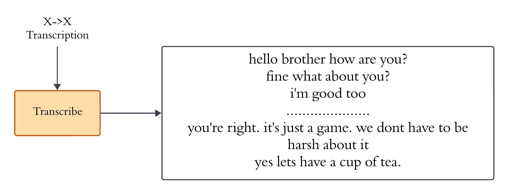

# Sound Censor: Automated Slang Detection for Profanity Filtering in Videos

## Introduction

Offensive content in multimedia presents challenges for creating family-friendly and inclusive environments. The **Sound Censor** project addresses this by automating the detection and muting of profane language in English videos. Using speech recognition, timestamped transcription, and dataset-based comparison, this system ensures offensive words are muted while preserving the contextual integrity of the original content. With a focus on accuracy and usability, this tool offers a solution to reduce the exposure of inappropriate content to younger audiences and families.


## Features

- **Language Detection**:
  - Automatically identifies the spoken language in videos.

- **Transcription**:
  - Converts audio content into plain English text.

- **Word-Level Timestamps**:
  - Associates each word in the audio with its corresponding timestamp.

- **Profanity Filtering**:
  - Matches detected words against a curated dataset of 2,648 offensive terms.

- **Output Generation**:
  - Mutes specific sections of the video based on detected profane words.

- **User-Friendly GUI**:
  - A Streamlit-based interface for uploading videos and obtaining filtered outputs.


## Dataset

A custom dataset containing 2,648 slang and offensive words was curated for this project. The dataset was collected from a variety of internet sources to ensure coverage of contemporary slang and abusive language.


## System Architecture

<p align="center">
  <span>
    
  </span>
  <br>
    <em>Fig 1: System Architecture(Whisper) </em>
</p>


## Workflow

1. **Input Video**:
   - The user uploads an English video file in formats like MP4 or WAV.

2. **Language Identification**:
   - If the language is unspecified, the system identifies the spoken language.
   - Workflow given below:
  
  <p align="center">
  <span>
    
  </span>
  <br>
    <em>Fig 2: Taking video and Language Identification </em>
</p>

3. **Transcription**:
   - Audio is converted into plain text using WhisperModel.
   - The step is like this
  <p align="center">
  <span>
    
  </span>
  <br>
    <em>Fig 3: Transcription </em>
</p>  

4. **Timestamp Generation**:
   - Each detected word is associated with its start and end timestamps.\
   - Workflow:
     <p align="center">
  <span>
    
  </span>
  <br>
    <em>Fig 4: Timestamp Generation </em>
</p>    

5. **Text Preprocessing**:
   - Removes punctuation and whitespace for improved dataset matching.

6. **Profanity Detection**:
   - Words are compared against the dataset, and matches are flagged for muting.
   - Workflow:
     <p align="center">
  <span>
    
  </span>
  <br>
    <em>Fig 4: Muting the slang words </em>
</p>  

7. **Output Video**:
   - The system generates a profanity-free video with muted sections
   - Workflow
 <p align="center">
  <span>
    
  </span>
  <br>
    <em>Fig 5: GUI </em>
</p>  

## Installation

### Prerequisites

- Python 3.8 or above
- `pip` package manager
- GPU support recommended (CUDA-compatible GPU)

### Steps

1. **Clone the repository**:
   ```bash
   git clone https://github.com/your-username/sound-censor.git
1. **Open it in Google Collab and run**:
